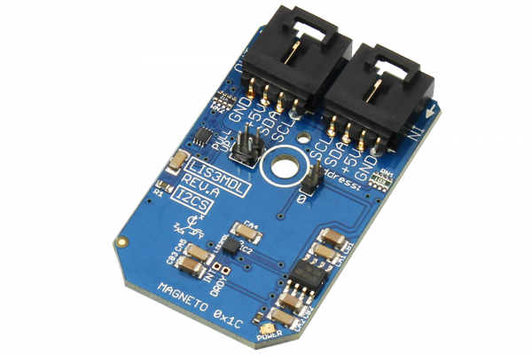

# LIS3MDL

LIS3MDL is an ultra-low-power high-performance three-axis magnetic sensor.The LIS3MDL has user-selectable full scales of ±4/ ±8/ ±12/ ±16 gauss.
This Device is available from www.ncd.io 

[SKU: LIS3MDL_I2CS]

(https://store.ncd.io/product/lis3mdl-3-axis-magnetometer-16-bit-i2c-mini-module/)
This Sample code can be used with Arduino.

Hardware needed to interface LIS3MDL sensor with Arduino

1. <a href="https://store.ncd.io/product/i2c-shield-for-arduino-nano/">Arduino Nano</a>

2. <a href="https://store.ncd.io/product/i2c-shield-for-arduino-micro-with-i2c-expansion-port/">Arduino Micro</a>

3. <a href="https://store.ncd.io/product/i2c-shield-for-arduino-uno/">Arduino uno</a>

4. <a href="https://store.ncd.io/product/dual-i2c-shield-for-arduino-due-with-modular-communications-interface/">Arduino Due</a>

5. <a href="https://store.ncd.io/product/lis3mdl-3-axis-magnetometer-16-bit-i2c-mini-module/">LIS3MDL 16Bit 3Axis Accelometer Sensor</a>

6. <a href="https://store.ncd.io/product/i%C2%B2c-cable/">I2C Cable</a>

LIS3MDL:

The LIS3MDL is an ultra-low-power high-performance three-axis magnetic sensor.The LIS3MDL has user-selectable full scales of ±4/ ±8/ ±12/ ±16 gauss.

Applications:

• Compasses

• Magnetometers

How to Use the LIS3MDL Arduino Library

The LIS3MDL has a number of settings, which can be configured based on user requirements.
          
1.Data rate setting:The following command is used to set the data rate.

            lis.setAccelDataRate(ACCEL_DATARATE_1HZ);           // AODR (Hz): 1
            
2.Accleration range selection:The following command is used to select the range of acceleration.

            lis.setAccelRange(ACCEL_RANGE_16G);                 // ±16 G
              
